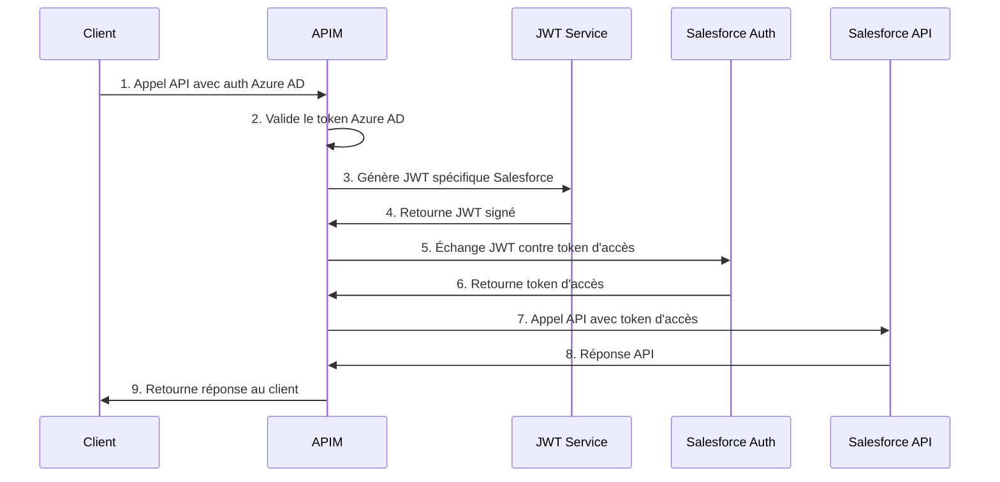

# apimsalesforce

**prompt: comment apim configure le jwt spécifique à salesforce ?**

Pour configurer Azure API Management (APIM) afin de générer et utiliser un JWT spécifique pour accéder aux API Apex REST de Salesforce, vous devez suivre plusieurs étapes clés. 

Voici un guide détaillé basé sur les informations disponibles et les meilleures pratiques.

* **Étape 1 : Créer une Application Connectée dans Salesforce**

  - Créer une Application Connectée :
  - Connectez-vous à Salesforce en tant qu'administrateur.
  - Allez dans Setup > App Manager > New Connected App.
  - Remplissez les champs requis, y compris le nom de l'application et l'URL de rappel (par exemple, https://yourdomain.com/callback).
  - Configurer les Paramètres OAuth :
    - Dans la section API (Enable OAuth Settings), cochez Enable OAuth Settings.
    - Ajoutez les OAuth Scopes nécessaires (par exemple, full, api).
    - Cochez Use digital signatures et téléchargez le certificat public correspondant à la clé privée que vous utiliserez pour signer le JWT.
    - Enregistrer l'Application :
    - Enregistrez l'application et notez le Consumer Key et le Consumer Secret.

* **Étape 2 : Générer un JWT Signé pour Salesforce**

    * **Créer le JWT :**
      Le JWT doit inclure les claims suivants :
      - iss : L'ID client de votre application connectée Salesforce (Consumer Key).
      - sub : Le nom d'utilisateur Salesforce ou l'ID de l'utilisateur.
      - aud : L'URL de l'instance Salesforce (par exemple, https://login.salesforce.com).
      - exp : Timestamp d'expiration (généralement 3 minutes après la création).
    * **Signer le JWT :**
    Utilisez une bibliothèque de cryptographie pour signer le JWT avec votre clé privée.

* **Étape 3 : Configurer Azure API Management (APIM)**
  
  - Configurer l'API dans APIM :
  - Dans le portail Azure, allez dans votre instance APIM.
  - Allez dans APIs et ajoutez une nouvelle API ou sélectionnez une API existante.
  - Ajouter une Politique pour Générer le JWT :

* **Ajoutez une politique pour générer le JWT spécifique à Salesforce :**

```xml
<send-request mode="new" response-variable-name="jwt-token">
  <set-url>https://yourdomain.com/generate-jwt</set-url>
  <set-method>POST</set-method>
  <set-header name="Content-Type" exists-action="override">
    <value>application/json</value>
  </set-header>
  <set-body>
    {
      "client_id": "your-client-id",
      "user": "salesforce-username",
      "audience": "https://login.salesforce.com"
    }
  </set-body>
</send-request>
```

* **Échanger le JWT contre un Token d'Accès Salesforce :**
Ajoutez une politique pour échanger le JWT contre un token d'accès Salesforce :

> [!CAUTION]
> ce code XML est erroné et corrigé plus bas.

```xml
<send-request mode="new" response-variable-name="access-token">
  <set-url>https://login.salesforce.com/services/oauth2/token</set-url>
  <set-method>POST</set-method>
  <set-header name="Content-Type" exists-action="override">
    <value>application/x-www-form-urlencoded</value>
  </set-header>
  <set-body>
    client_id=your-client-id&client_secret=your-client-secret&grant_type=urn:ietf:params:oauth:grant-type:jwt-bearer&assertion=@(context.Variables["jwt-token"].Value)
  </set-body>
</send-request>
```

**Utiliser le Token d'Accès pour Appeler l'API Salesforce :**
Ajoutez une politique pour utiliser le token d'accès dans les appels API :

```xml
<set-header name="Authorization" exists-action="override">
  <value>Bearer @{context.Variables["access-token"].Value}</value>
</set-header>
```

**Diagramme de Séquence**
Voici le diagramme de séquence en utilisant la syntaxe Mermaid pour illustrer ce processus :



Ce diagramme montre comment les différents composants interagissent pour permettre l'accès sécurisé à une API Apex REST de Salesforce via Azure API Management en utilisant un jeton JWT signé avec une clé privée connue de Salesforce. Les étapes incluent la génération et l'échange du JWT, ainsi que l'utilisation du token d'accès pour les appels API.

**prompt: <set-url>https://yourdomain.com/generate-jwt</set-url> quel est ce domaine ?**

La ligne de code <set-url>https://yourdomain.com/generate-jwt</set-url> fait référence à une URL fictive utilisée à titre d'exemple dans la configuration d'une politique Azure API Management (APIM). Dans un scénario réel, cette URL devrait être remplacée par l'adresse d'un service réel capable de générer un JWT (JSON Web Token) spécifique pour Salesforce.

Voici quelques points importants à considérer :
- Service personnalisé : "yourdomain.com" n'est pas un domaine réel pour ce service. Dans une implémentation pratique, vous devriez remplacer cela par l'URL d'un service que vous avez créé et déployé spécifiquement pour générer des JWT conformes aux exigences de Salesforce.
- Options d'implémentation : Ce service de génération de JWT pourrait être :
  - Une fonction Azure
  - Un service web personnalisé hébergé sur Azure App Service
  - Un endpoint d'une API existante dans votre infrastructure
- Sécurité : Quelle que soit l'option choisie, ce service doit être sécurisé et accessible uniquement par votre instance APIM.
- Fonctionnalité : Le service à cette URL devrait être capable de :
  - Recevoir les paramètres nécessaires (comme l'ID client, le nom d'utilisateur, etc.)
  - Générer un JWT avec les claims requis par Salesforce
  - Signer le JWT avec la clé privée correspondant au certificat public fourni à Salesforce
  - Alternative : Si vous préférez ne pas créer un service externe, vous pourriez potentiellement implémenter cette logique directement dans une politique APIM plus complexe, en utilisant des expressions et des fonctions C# intégrées.

En résumé, https://yourdomain.com/generate-jwt est un espace réservé dans l'exemple, et vous devez le remplacer par l'URL réelle de votre service de génération de JWT pour Salesforce dans votre implémentation.

**prompt: créer la fonction azure qui peut créer un token jwt avec n'importe quel language**

Pour créer une fonction Azure qui génère un token JWT pour Salesforce, vous pouvez utiliser différents langages de programmation. 

Voici un exemple de mise en œuvre en utilisant C# avec .NET, qui est largement utilisé pour les fonctions Azure :
- Créez une nouvelle fonction Azure dans le portail Azure ou via Visual Studio.
- Choisissez le modèle de déclencheur HTTP.
- Installez les packages NuGet suivants :
  - System.IdentityModel.Tokens.Jwt
  - Microsoft.IdentityModel.Tokens

Voici un exemple de code pour la fonction :

```csharp
using System;
using System.IdentityModel.Tokens.Jwt;
using System.Security.Claims;
using System.Security.Cryptography.X509Certificates;
using Microsoft.AspNetCore.Mvc;
using Microsoft.Azure.WebJobs;
using Microsoft.Azure.WebJobs.Extensions.Http;
using Microsoft.AspNetCore.Http;
using Microsoft.IdentityModel.Tokens;

public static class SalesforceJwtGenerator
{
    [FunctionName("GenerateSalesforceJwt")]
    public static IActionResult Run(
        [HttpTrigger(AuthorizationLevel.Function, "post", Route = null)] HttpRequest req)
    {
        // Récupérer les paramètres de la requête
        string clientId = req.Query["clientId"];
        string username = req.Query["username"];
        string audience = req.Query["audience"];
        string privateKeyPath = Environment.GetEnvironmentVariable("PrivateKeyPath");

        if (string.IsNullOrEmpty(clientId) || string.IsNullOrEmpty(username) || string.IsNullOrEmpty(audience))
        {
            return new BadRequestObjectResult("Please provide clientId, username, and audience in the query string.");
        }

        // Charger le certificat contenant la clé privée
        var cert = new X509Certificate2(privateKeyPath, "password");

        // Créer les claims pour le JWT
        var claims = new[]
        {
            new Claim("iss", clientId),
            new Claim("sub", username),
            new Claim("aud", audience),
            new Claim("exp", DateTimeOffset.UtcNow.AddMinutes(3).ToUnixTimeSeconds().ToString())
        };

        // Créer le JWT
        var token = new JwtSecurityToken(
            claims: claims,
            signingCredentials: new SigningCredentials(new X509SecurityKey(cert), SecurityAlgorithms.RsaSha256)
        );

        // Générer le token sous forme de string
        var tokenHandler = new JwtSecurityTokenHandler();
        var tokenString = tokenHandler.WriteToken(token);

        return new OkObjectResult(tokenString);
    }
}
```

**Configurez les variables d'environnement de la fonction :**
- Ajoutez une variable PrivateKeyPath pointant vers le fichier .pfx contenant votre clé privée.
- Déployez la fonction sur Azure.

**Pour utiliser cette fonction avec Azure API Management :**

Dans APIM, ajoutez une politique pour appeler cette fonction Azure :

```xml
<send-request mode="new" response-variable-name="jwt-token" timeout="20" ignore-error="true">
    <set-url>https://your-function-app.azurewebsites.net/api/GenerateSalesforceJwt</set-url>
    <set-method>POST</set-method>
    <set-query-parameter name="clientId" exists-action="override">
        <value>{{salesforce-client-id}}</value>
    </set-query-parameter>
    <set-query-parameter name="username" exists-action="override">
        <value>{{salesforce-username}}</value>
    </set-query-parameter>
    <set-query-parameter name="audience" exists-action="override">
        <value>{{salesforce-audience}}</value>
    </set-query-parameter>
</send-request>
```

Utilisez le JWT généré pour obtenir un token d'accès Salesforce :

```xml
<send-request mode="new" response-variable-name="salesforce-token" timeout="20" ignore-error="true">
    <set-url>https://login.salesforce.com/services/oauth2/token</set-url>
    <set-method>POST</set-method>
    <set-header name="Content-Type" exists-action="override">
        <value>application/x-www-form-urlencoded</value>
    </set-header>
    <set-body>@{
        return $"grant_type=urn:ietf:params:oauth:grant-type:jwt-bearer&assertion={context.Variables["jwt-token"]}";
    }</set-body>
</send-request>
```

**Utilisez le token d'accès Salesforce pour les appels API :**

```xml
<set-header name="Authorization" exists-action="override">
    <value>@("Bearer " + ((JObject)context.Variables["salesforce-token"]).Value<string>("access_token"))</value>
</set-header>
```

Cette approche permet de générer de manière sécurisée un JWT pour Salesforce en utilisant une fonction Azure, puis d'utiliser ce JWT pour obtenir un token d'accès Salesforce via APIM.


**prompt: Échanger le JWT contre un Token d'Accès Salesforce , il n'est pas nécessaire de fournir client id et client secret en plus de l'assertion**

> [!TIP]
> il s'agit de la correction de la politique APIM erronée plus haut.

Vous avez raison, et je vous remercie de soulever ce point important. En effet, lors de l'échange du JWT contre un Token d'Accès Salesforce en utilisant le flux JWT Bearer, il n'est pas nécessaire de fournir le client_id et le client_secret en plus de l'assertion. Voici la correction et les explications :
Pour échanger le JWT contre un Token d'Accès Salesforce, vous devez uniquement fournir :
  - Le grant_type
  - L'assertion (qui est le JWT signé)
    
Voici la politique APIM corrigée pour échanger le JWT contre un Token d'Accès Salesforce :

```xml
<send-request mode="new" response-variable-name="salesforce-token" timeout="20" ignore-error="true">
    <set-url>https://login.salesforce.com/services/oauth2/token</set-url>
    <set-method>POST</set-method>
    <set-header name="Content-Type" exists-action="override">
        <value>application/x-www-form-urlencoded</value>
    </set-header>
    <set-body>@{
        return $"grant_type=urn:ietf:params:oauth:grant-type:jwt-bearer&assertion={context.Variables["jwt-token"]}";
    }</set-body>
</send-request>
```

Explications :

- grant_type=urn:ietf:params:oauth:grant-type:jwt-bearer : Ceci indique à Salesforce que nous utilisons le flux JWT Bearer.
- assertion={context.Variables["jwt-token"]} : C'est le JWT signé que nous avons généré précédemment.
- Le client_id n'est pas nécessaire car il est déjà inclus dans le JWT en tant que claim "iss" (issuer).
- Le client_secret n'est pas requis car la signature du JWT avec la clé privée remplace la nécessité d'un secret client distinct.
- Cette approche est plus sécurisée car :
  - Le client_id est déjà encodé dans le JWT.
  - La signature du JWT avec la clé privée prouve l'authenticité de la demande, rendant le client_secret redondant.
- En utilisant cette méthode, vous réduisez la quantité d'informations sensibles transmises lors de chaque échange de token, ce qui améliore la sécurité globale de votre intégration avec Salesforce.


**L'URL de callback** correspond à l'application appelante dans le contexte de l'authentification OAuth avec Salesforce. 

Voici les points clés à retenir :
  - L'URL de callback est un point de terminaison dans votre application appelante (celle qui demande l'accès à Salesforce) .
  - Salesforce utilise cette URL pour rediriger l'utilisateur après l'autorisation OAuth .
  - Elle est également appelée "URL de rappel" ou "endpoint" que Salesforce utilise pour communiquer avec votre application pendant le processus OAuth .
  - Dans le flux OAuth, après que l'utilisateur autorise l'accès, Salesforce redirige vers cette URL de callback avec le code d'autorisation ou les jetons nécessaires .
    Par exemple, si votre application s'appelle "My Customer Order Status", l'URL de callback pourrait ressembler à :
    https://www.mycustomerorderstatus.com/oauth2/callback 
  - Il est important de noter que cette URL doit être configurée à l'avance dans les paramètres de votre application connectée dans Salesforce .
  - Pour les applications web, mobiles ou de bureau, l'URL de callback doit être un endpoint que votre application peut gérer pour recevoir et traiter la réponse OAuth de Salesforce .
  - En résumé, l'URL de callback fait partie de votre application appelante et non de Salesforce (l'application appelée). C'est l'endroit où votre application attend de recevoir les informations d'authentification après que l'utilisateur a autorisé l'accès via Salesforce.
